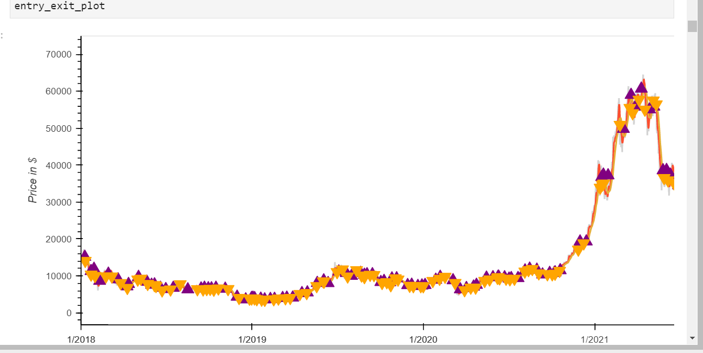
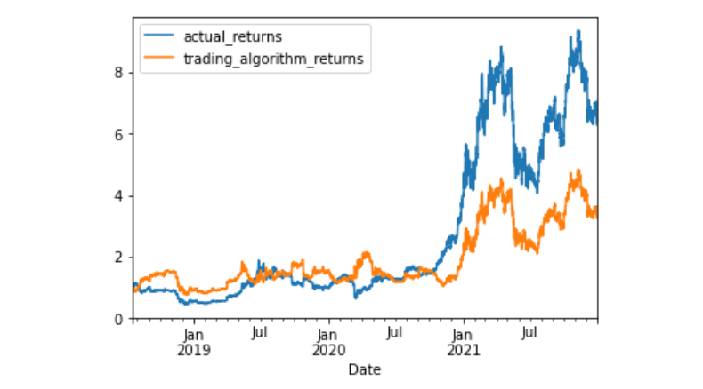
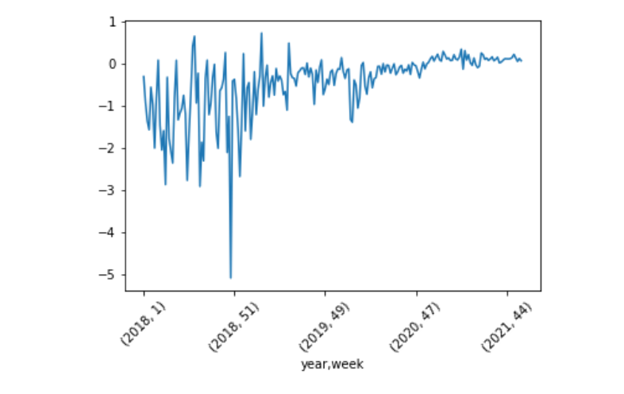
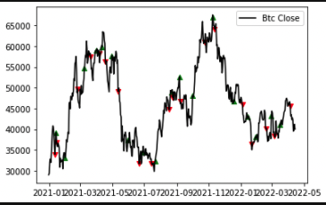

**Project Title: Algo Crypto Trading with Machine Learning** 

Our Team created an algorithm to identify the best time to buy and sell Bitcoin.  The algorithm will  uses  a short-window (50 days) SMA and a long-window (100 days) to predict the best time to buy and sell bitcoin.

**Technologies** 

The code is written in Py 3.0 using Google Colab

**Installation Guide** 

must be run in googlecolab - https://colab.research.google.com/

**Please use Trade_Bot_colab.ipynb in google Colab. Includes Colab code**

**Libraries**

import hvplot.pandas

from pathlib import Path

import matplotlib.pyplot as plt

from sklearn import svm

from sklearn.preprocessing import StandardScaler

from pandas.tseries.offsets import DateOffset

from sklearn.metrics import classification_report

from imblearn.over_sampling import RandomOverSampler

from sklearn.svm import SVC

from finta import TA

import ta

import pandas_ta as pta

from plotly.subplots import make_subplots

import plotly.graph_objects as go

pd.set_option('display.max_rows', 2000)

pd.set_option('display.max_columns', 2000)

pd.set_option('display.width', 1000)

Installation Guide - **must be run in googlecolab** - https://colab.research.google.com/

pip install bitfinex-tencars

pip install ta

pip install pandas-ta

pip install finta 

**Data Collection** 

We used the public API Bitfinex to pull the bitcoin data form 2018 to 2022.  
We saved this information into a csv file. 
We then read the CSV into our algo bot and used this information to test the bot.

**Buy Sell Strategy** 

Moving averages were to create buy and sell signals

EMA(current) = ((price(current)-EMA(prev) x Multiplier 

SMA = SUM of closing prices/number of days

The lower moving average triggered the buy signal.

The higher moving average triggered the sell signal.

When the price  was within 3% of the lower or higher moving average the bot will alert the user to buy or sell bitcoin.

**Results**

We tested our model using SVM and we learned that our model underperformed. 

The SVM prediction model showed that between January 2018 and  Jan 2022 if we had held bitcoin we would have made more money than if we followed our strategy.  

The strategy returns graph shows that is we applied our our trading bot we would have lost all our money by January 2021

Actual vs Stradegy Returns

Weekly Returns Graph

Stradegy Returns Plot 
.png)

**Tested with different Signals"**

MACD & RSI 

**Conclusions**

The Bot performs the actions as expected 

The indicators used proved not to be optimal

Test other indicators like MACD and RSI

Experiment with different long and short window periods

**Fututre Revisions**

Use a live API

Automate the buy and sell orders

Account for transaction fees

**Contributors** 

In addtion to Team 1 Project 2 the GW Bootcamp TA, LA, and tutors help me create this project

**License and Disclaimer** 

The Source code is for educational purposes only and should not be used to make any professional recomendations. Feel free to use for any educational need